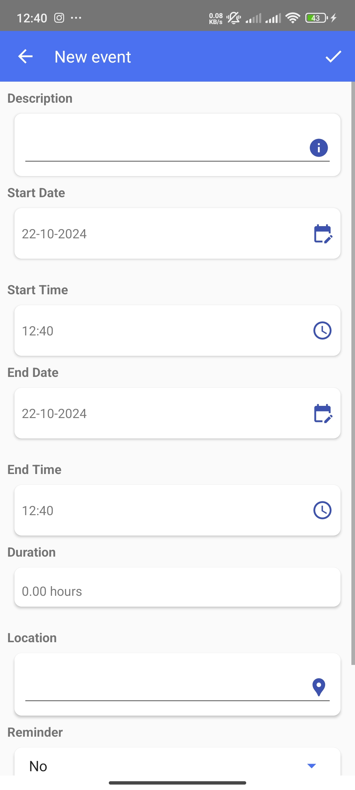
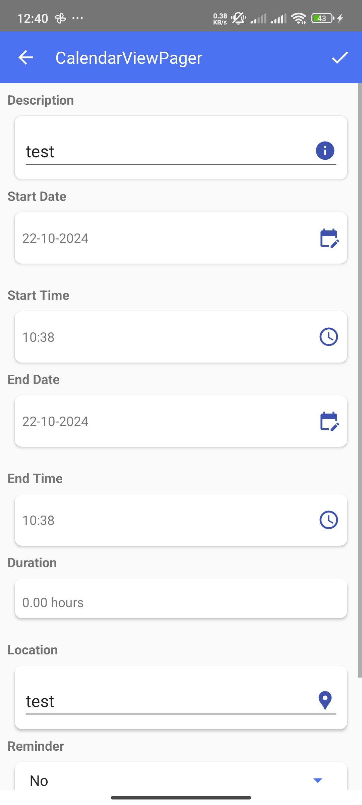
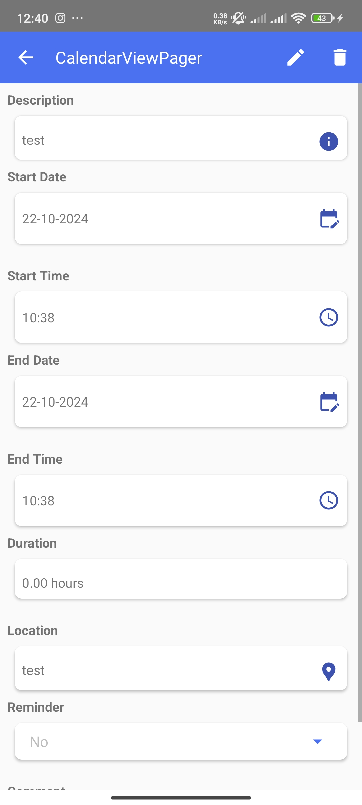
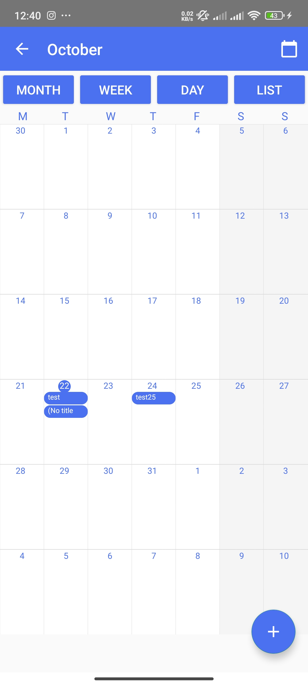
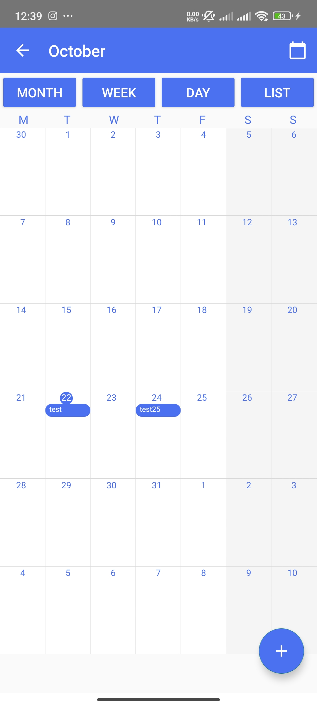
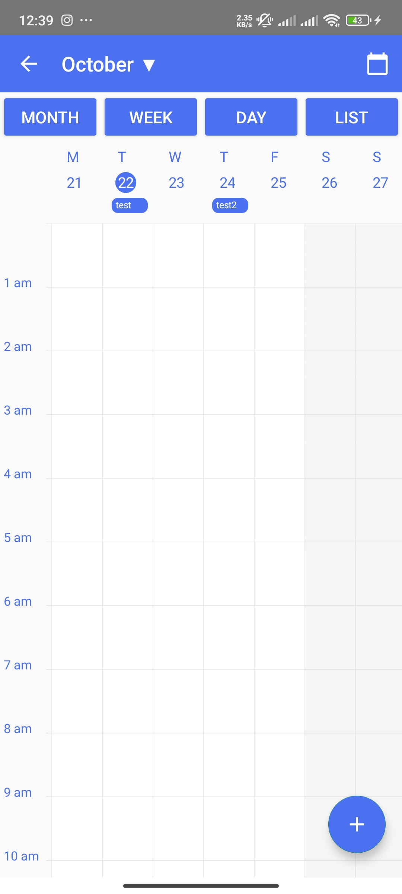
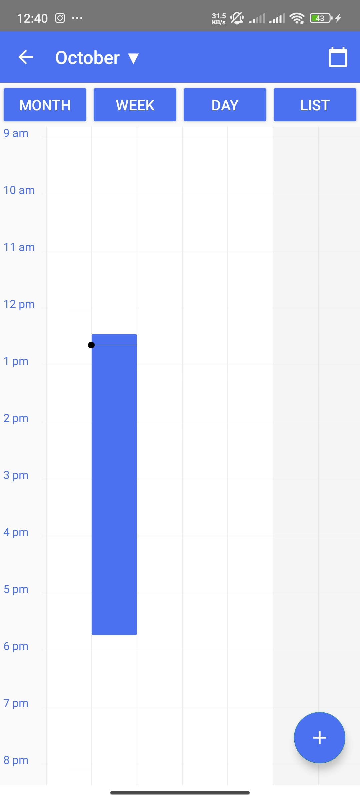
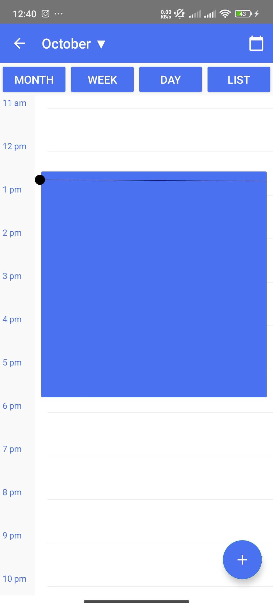
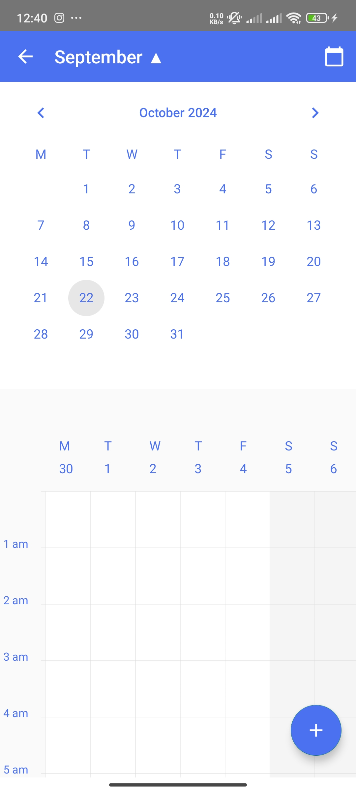
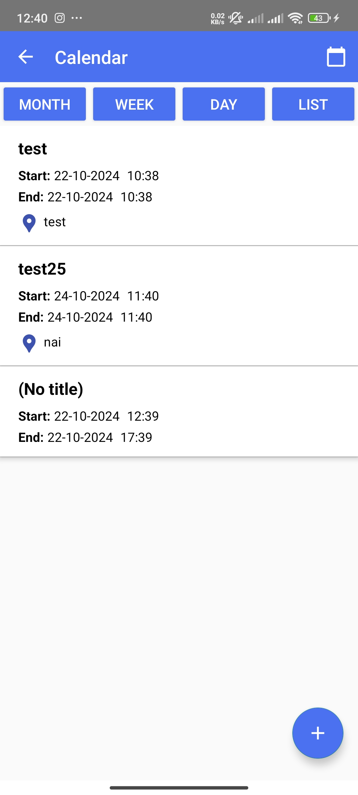

# CalendarViewPager

## Description
My app is a calendar that features month, week, and day views, along with a list view for events. The main advantage is that it is built with ViewPager and utilizes Canvas for a lightweight and modern UI.

## Features
- Month, week, and day views
- List view for events
- All CRUD operations for events via DatabaseHelper
- Pop-up window for fast navigation
- Reminder functionality with notifications

## Technologies Used
- Android Studio (Java)
- ViewPager2


## Usage
Users can navigate through the calendar in every view (month, week, and day), create events with custom durations, and add reminders for notifications. To interact with the app:

1. **Navigate to Calendar**: Use the ViewPager to switch between month, week, and day views.
2. **Create Events**: Tap on a date to open the event creation dialog. You can specify the event's duration and details.
3. **View Events**: Access the list view to see all created events.
4. **Edit/Delete Events**: Long-press on an event to edit or delete it.
5. **Set Reminders**: When creating or editing an event, you can set reminders that will trigger notifications.


## License
This project is licensed under the MIT License. See the [LICENSE](LICENSE) file for more details.

## Contributing
Contributions are welcome! To contribute to this project, please follow these steps:

1. Fork the repository.
2. Create a new branch (`git checkout -b feature-branch`).
3. Make your changes and commit them (`git commit -m 'Add some feature'`).
4. Push to the branch (`git push origin feature-branch`).
5. Open a pull request.

Please ensure your code follows the project’s style guide and that any new features include appropriate tests.

## Contact Information
You can reach me via my [LinkedIn](linkedin.com/in/christos-damianidis-71668920a) or visit my 
[Website](https://christos-damianidis.lovestoblog.com/?i=1) for feedback or questions.


## Installation Instructions
You can clone this repository from GitHub to run the app locally. Use the following command:

```bash
git clone https://github.com/christosdamianidis99/CalendarViewPager.git
```
## Screenshots

| New Event | Edit Event | Show Event |
|-----------|------------|------------|
|  |  |  |

| Month View | Month View 2 | Week View |
|------------|---------------|-----------|
|  |  |  |

| Week View 2 | Day View | Popup Window |
|--------------|----------|--------------|
|  |  |  |

| List View |
|-----------|
|  |
